# AVL树 自动化测试报告

| 编号 | 测试项 | 结果 | 详情 |
|------|--------|------|------|
| T01 | 插入15个节点 | PASS | 新增=15 中序=[10, 20, 25, 30, 35, 40, 45, 50, 55, 60, 65, 70, 75, 80, 85] |
| T02 | 中序遍历 | PASS | [10, 20, 25, 30, 35, 40, 45, 50, 55, 60, 65, 70, 75, 80, 85] |
| T03 | 查看深度 | PASS | depth=4 理论上限=6 |
| T04 | 叶子节点数 | PASS | leaves=8 |
| T05 | 先序遍历(递归vs栈) | PASS | 递归=[50, 30, 20, 10, 25, 40, 35, 45, 70, 60, 55, 65, 80, 75, 85] 栈=[50, 30, 20, 10, 25, 40, 35, 45, 70, 60, 55, 65, 80, 75, 85] |
| T06 | 后序遍历(递归vs栈) | PASS | 递归=[10, 25, 20, 35, 45, 40, 30, 55, 65, 60, 75, 85, 80, 70, 50] 栈=[10, 25, 20, 35, 45, 40, 30, 55, 65, 60, 75, 85, 80, 70, 50] |
| T07 | 层次遍历 | PASS | [50, 30, 70, 20, 40, 60, 80, 10, 25, 35, 45, 55, 65, 75, 85] |
| T08 | 查找(存在) 25 | PASS |  |
| T09 | 查找(存在) 85 | PASS |  |
| T10 | 查找(存在) 50(根) | PASS |  |
| T11 | 查找(不存在) 99 | PASS |  |
| T12 | 查找(不存在) 0 | PASS |  |
| T13 | 查找(不存在) -5 | PASS |  |
| T14 | 镜像(中序反转) | PASS | 前=[10, 20, 25, 30, 35, 40, 45, 50, 55, 60, 65, 70, 75, 80, 85] 后=[85, 80, 75, 70, 65, 60, 55, 50, 45, 40, 35, 30, 25, 20, 10] |
| T15 | 删除叶子 10 | PASS | 中序=[20, 25, 30, 35, 40, 45, 50, 55, 60, 65, 70, 75, 80, 85] |
| T16 | 删除单子 20 | PASS | 中序=[25, 30, 35, 40, 45, 50, 55, 60, 65, 70, 75, 80, 85] |
| T17 | 删除双子(根) 50 | PASS | 中序=[25, 30, 35, 40, 45, 55, 60, 65, 70, 75, 80, 85] |
| T18 | 删除全部12个剩余节点 | PASS | empty=1 depth=0 |
| T19 | LL旋转([30,20,10] -> 根为20) | PASS | 先序=[20, 10, 30] |
| T20 | RR旋转([10,20,30] -> 根为20) | PASS | 先序=[20, 10, 30] |
| T21 | LR旋转([30,10,20] -> 根为20) | PASS | 先序=[20, 10, 30] |
| T22 | RL旋转([10,30,20] -> 根为20) | PASS | 先序=[20, 10, 30] |
| T23 | 删除触发重平衡(删20后树仍平衡) | PASS | depth=3 中序=[5, 10, 12, 15, 18, 25] |
| T24 | 重复插入(第二次返回false) | PASS | 第一次=1 第二次=0 |
| T25 | 删除不存在的节点 | PASS |  |

---

**总计**: 25 用例 | **通过**: 25 | **失败**: 0

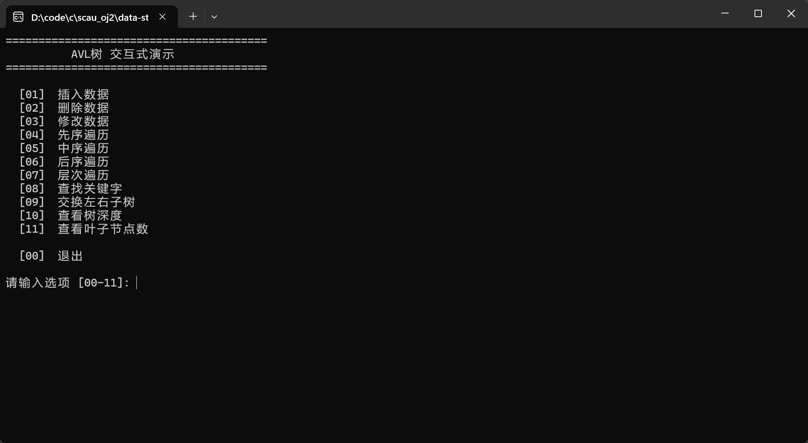

## episode 1

10 20 25 30 35 40 45 50 55 60 65 70 75 80 85

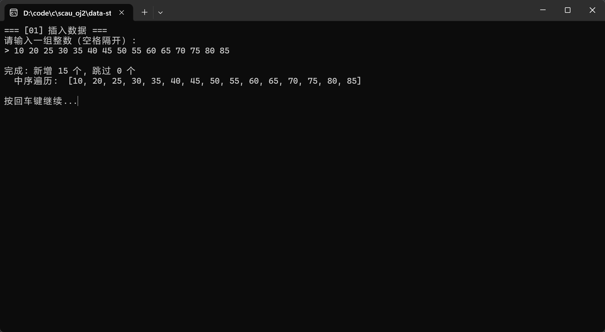

## episode 2

先序遍历

中序遍历

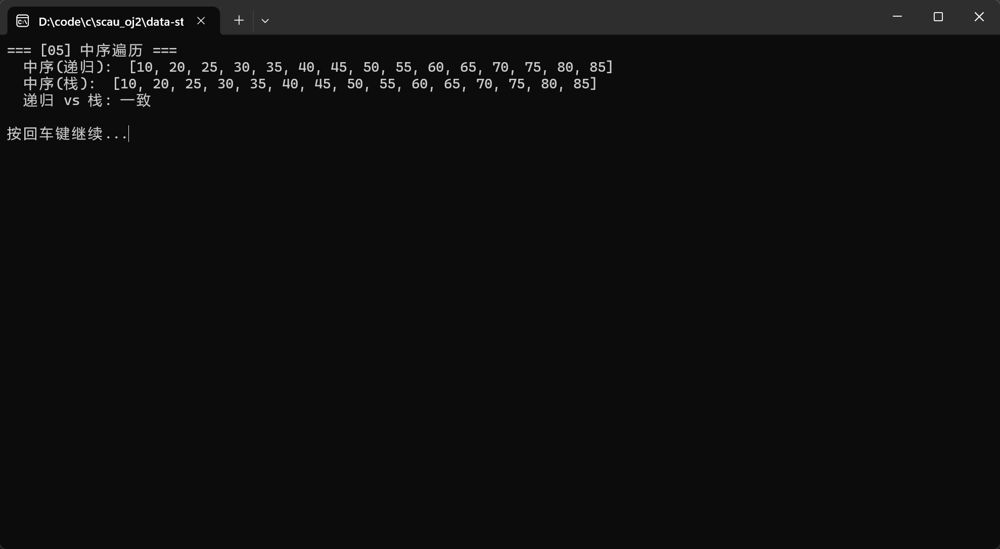

后序遍历

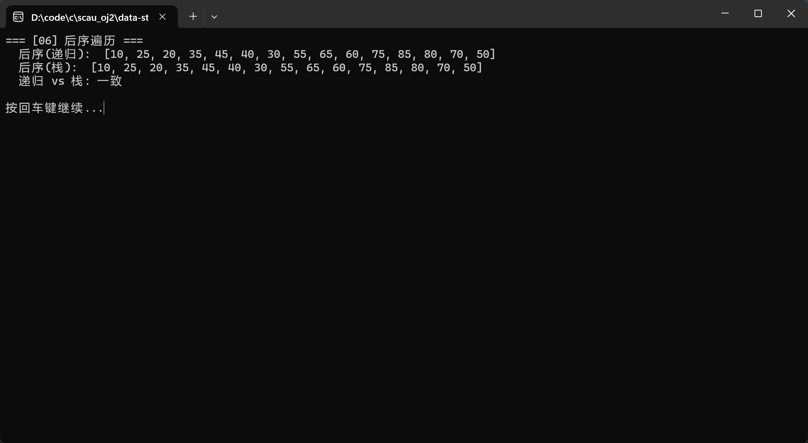

层次遍历

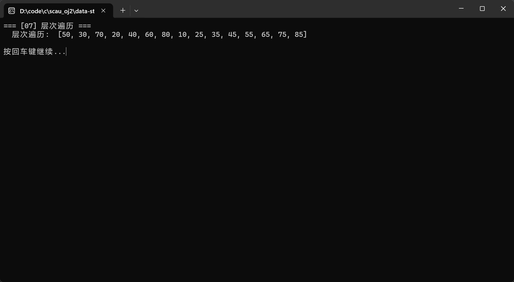

## episode 3

查找关键字

找70 20 100 -1

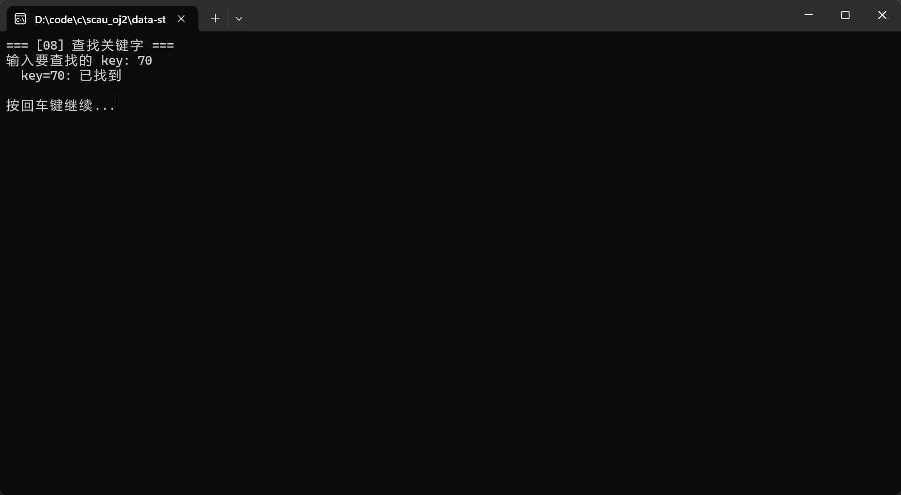

## episode 4

#### deep

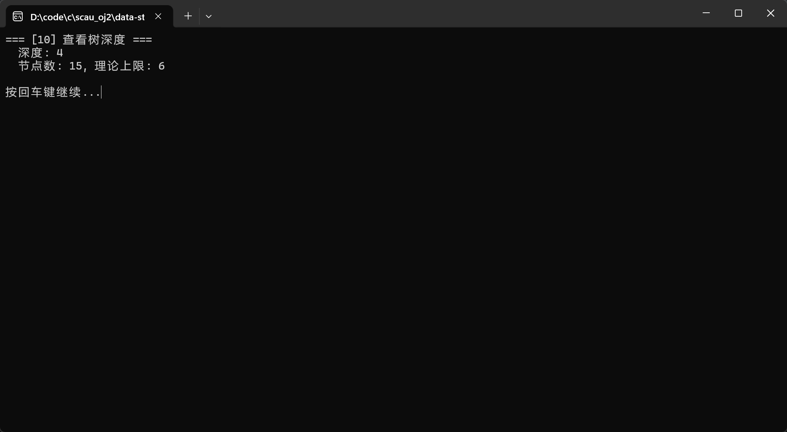

#### del

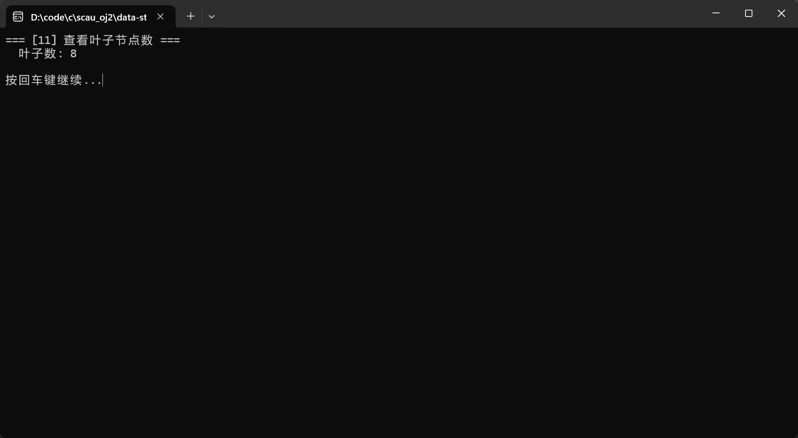

## episode 5

del 30

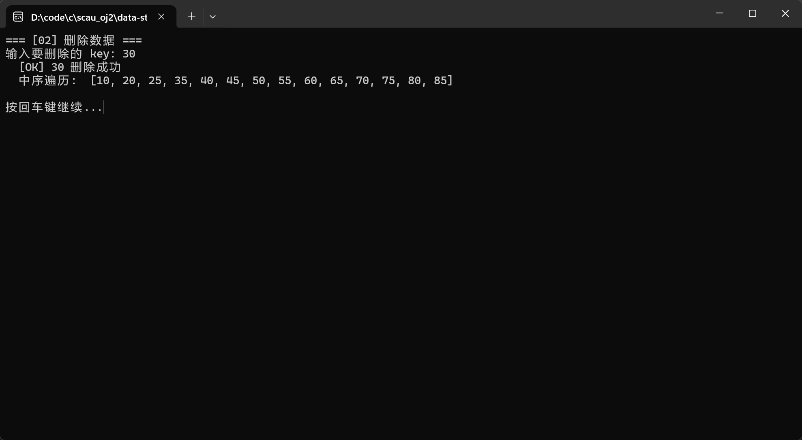

del 80

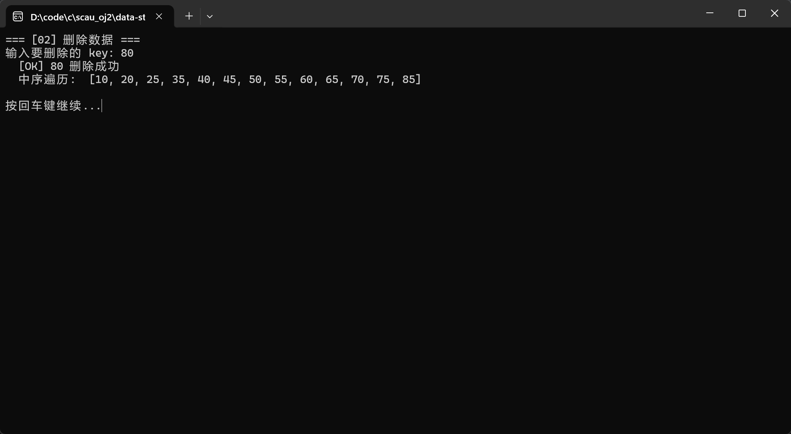

### episode 6

40 -> 41

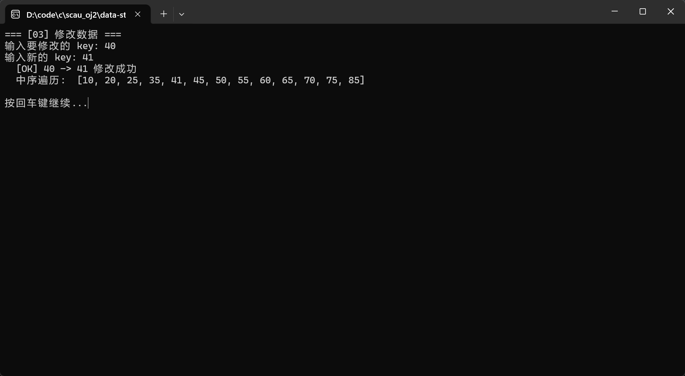

### episode 9 mirror

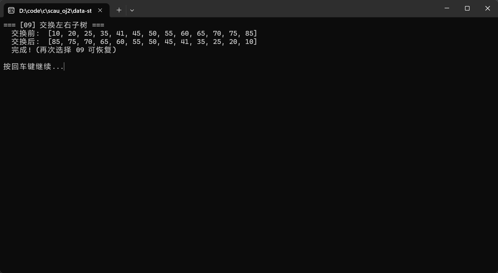